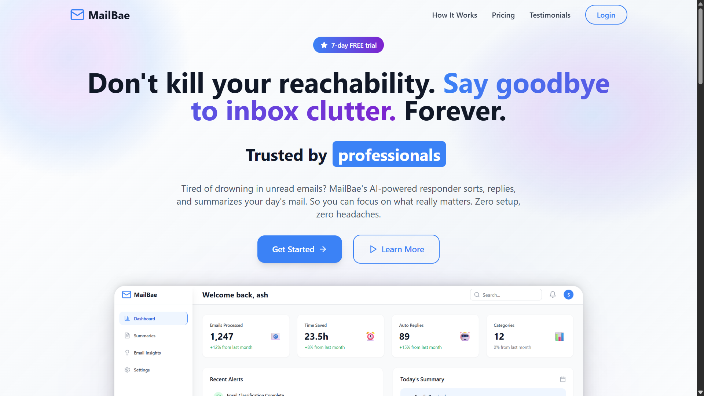
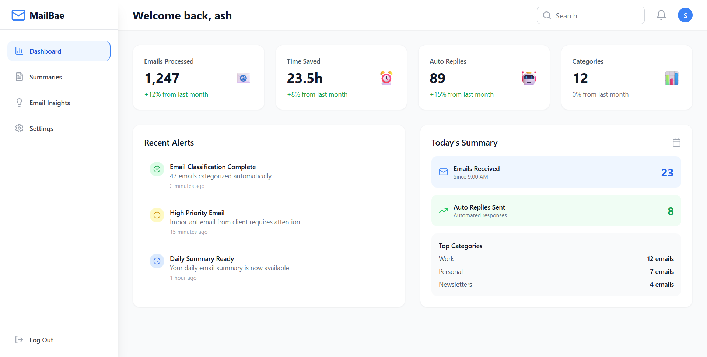
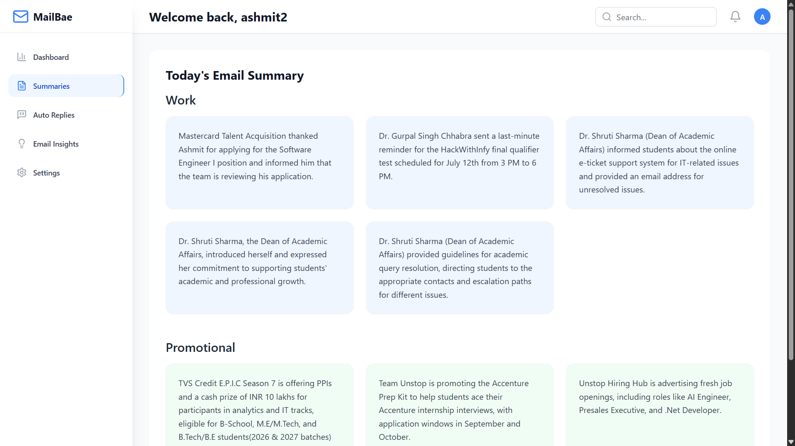
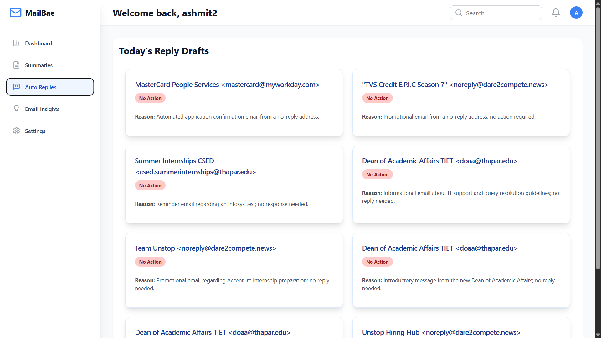

<h1 align="center">MailBae</h1>
<h3 align="center">Your AI Inbox Manager</h3>

<p align="center">
  
  
  
</p>

[MailBae](https://mailbae.vercel.app) is your personal AI agent that reads emails, summarizes them, auto-drafts replies, and helps you declutter your inbox - so you focus only on what matters.

## 🌟 Features

🔹 **Daily Smart Summaries**  
Receive clean, categorized summaries of your unread emails, every morning at your preferred time.

🔹 **AI Auto-Responder**  
Automatically classifies which emails need a reply and generates context-aware, human-like responses.

🔹 **Email Insights & Reporting (Beta)**  
Track patterns, generate custom insights from email content, and visualize your inbox activity.

🔹 **One-Click Gmail Connect**  
Securely authenticate via Google OAuth. Your credentials are stored safely and refreshed automatically.

🔹 **Tagging & Calendar Integration (Upcoming)**  
Auto-tag emails and schedule meetings directly from email content using AI agents.


## 🧠 Tech Stack

| Layer            | Tech Used |
|------------------|-----------|
| **Frontend**     | Next.js, TailwindCSS, Framer Motion |
| **Auth**         | Supabase Auth + Google OAuth (NextAuth) |
| **Backend**      | FastAPI (Python) |
| **AI**           | Gemini 2.0 Flash via Python SDK |
| **DB**           | Supabase PostgreSQL |
| **Agent Logic**  | LangChain + custom prompt engineering |


## 🚀 How to Run

### 1. Clone the Repo

```bash
git clone https://github.com/ashmit0920/MailBae.git
cd MailBae
```

### 2. Environment Setup

Create a .env file in both the frontend and root folders:

For Next.js (.env.local)

```env
GOOGLE_CLIENT_ID=your_google_client_id
GOOGLE_CLIENT_SECRET=your_google_client_secret
NEXTAUTH_SECRET=your_nextauth_secret
NEXTAUTH_URL=http://localhost:3000
NEXT_PUBLIC_SUPABASE_URL=your_supabase_url
SUPABASE_SERVICE_ROLE_KEY=your_supabase_service_role_key
```

For FastAPI (.env)

```env
SUPABASE_URL=your_supabase_url
SUPABASE_SERVICE_KEY=your_supabase_service_key
GOOGLE_CLIENT_ID=your_google_client_id
GOOGLE_CLIENT_SECRET=your_google_client_secret
```

### 3. Run the Project

Start FastAPI Backend

```bash
uvicorn main:app --reload --port 8000
```

Start Next.js Frontend

```bash
cd MailBae-frontend
npm install
npm run dev
```

Visit ```http://localhost:3000``` to get started.

## Screenshots

Landing Page



Dashboard



Daily Summary section



Auto-Responder




## Contact & Feedback

Made with ☕ and code by Ashmit.
Open to feedback, collaboration, or feature suggestions - feel free to reach out!